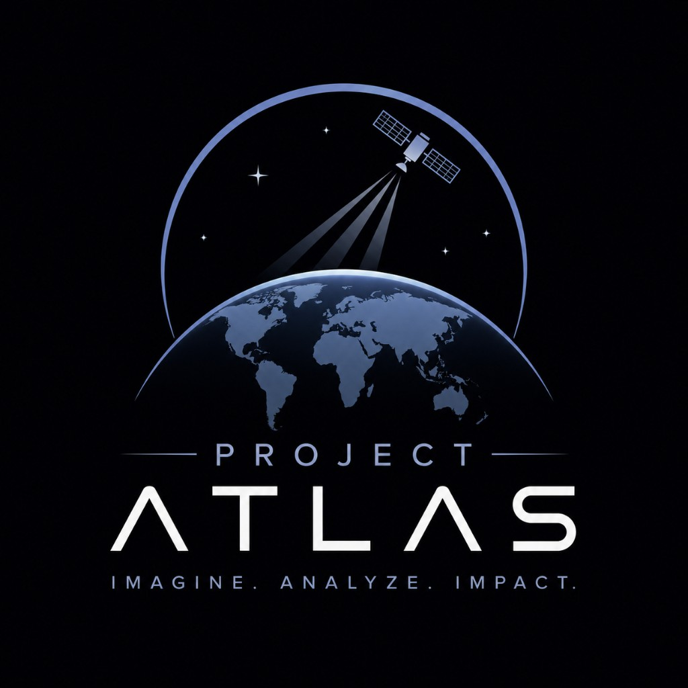

# ATLAS

**Automated Toolkit for Land, Atmosphere, and Sustainability**

<p align="center">
  
</p>

## Overview

ATLAS is a research project in **harness engineering** at the intersection of
aerospace and computer science: automated, cost-efficient satellite imagery
analysis, in part with LLMs. The official focus is satellite data analysis focused on geographical and environmental changes across available data.

## Contribute!

### Set up

For installation, see the following guide to set up your machine for development:

- [macOS](install-instructions/INSTALL-MAC.md)
- [Windows](install-instructions/INSTALL-WINDOWS.md)
- [Linux](install-instructions/INSTALL-LINUX.md)

### Docstrings

New and changed public Python APIs use [Google docstring
style](https://google.github.io/styleguide/pyguide.html#38-comments-and-docstrings)
(`Args:`, `Returns:`, `Raises:`). Docstring formatting is primarily for
functions, methods, and classes, as seen in 3.8.3 and 3.8.4. Ruff is set to
`convention = "google"`.

### Checks
Most checks run automatically on every commit via pre-commit hooks (once
installed). You can also run the full verification suite manually:

```bash
uv run pytest                       # run tests (no live APIs)
uv run ruff check .                 # lint
uv run ruff format .                # format
uv run mypy src                     # type-check
uv run pre-commit run --all-files   # run all hooks on the whole repo
```

### Versioning

Every merge to `main` must bump `[project].version` in `pyproject.toml`. Do not
land on `main` at the same version as the previous release. From `0.1.0`:

```bash
uv version --bump patch   # 0.1.0 → 0.1.1   bug fix, docs, internal change
uv version --bump minor   # 0.1.0 → 0.2.0   new feature, backward compatible
uv version --bump major   # 0.1.0 → 1.0.0   breaking API or data-contract change
```
